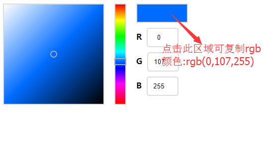

## 选色器
目前只支持RGB颜色的选取，使用如下:     
```html
<div id="color"></div>
```
```js
//1.先在页面中引入js/colorBoard.js或者npm
//2.实例化选色器对象
new ColorBoard({
    el: '#color',  // 选色器的容器id
    initColor: 'rgb(255, 255, 255)', // 初始颜色
    colorChange: function(rgb){ // 当选色改变时的回调，rgb为选中的颜色

    },
    //可选
        // 细粒度
    fine: {
        width: 400, // 默认200
        height: 400 // 默认200
    },
        // 粗粒度
    coarse: {
        width: 40, // 默认20
        height: 400, // 默认200
    },
        // 数值面板
    board: {
        width: 100, // 默认 100
        height: 50 // 默认 35
    }    
});
```
选色器由三部分组成：细粒度，粗粒度，数值面板。     
效果图：  
